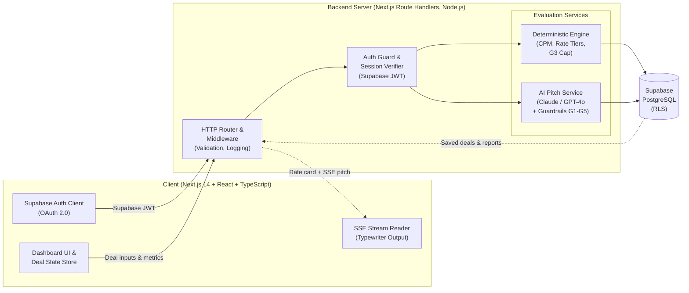
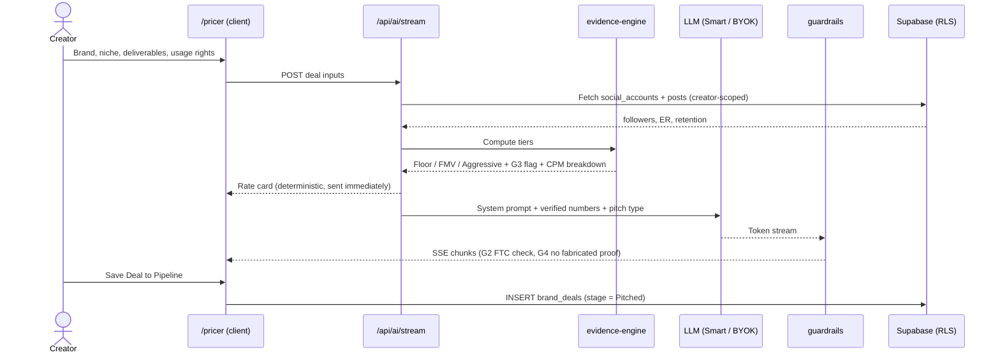
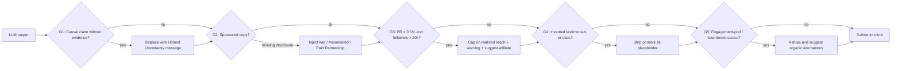
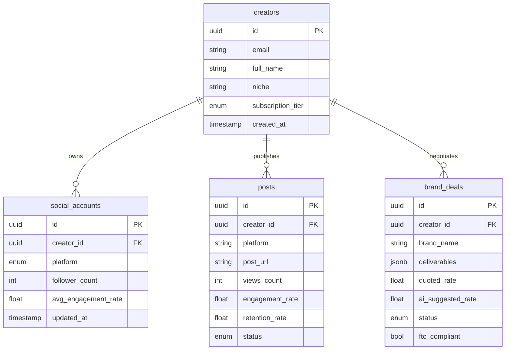
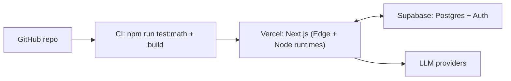

# CreatorPulse AI: Growth Co-Pilot & Commercial Deal Negotiator

> A full-stack web application that helps social media creators and micro-influencers (5k to 250k followers) price brand deals, write pitches and diagnose post performance.
> Inspired by the *Crest* Co-Pilot SRS specification.


---

## Table of Contents

1. [Key Capabilities](#-key-capabilities)
2. [System Architecture](#-system-architecture)
3. [Tech Stack](#-tech-stack)
4. [Quick Start](#-quick-start)
5. [Environment Variables](#-environment-variables)
6. [Built-In Test Personas](#-built-in-test-personas)
7. [Project Structure](#-project-structure)
8. [Testing](#-testing)
9. [Deployment](#-deployment)
10. [Security & Compliance](#-security--compliance)
11. [Roadmap](#-roadmap)

---

## 🌟 Key Capabilities

### 1. Executive Creator Dashboard (`/dashboard`)
- Connected social account switcher (`@AnanyaStyle`, `Aarav Tech`, `Meera Skincare`).
- Net Creator Revenue tracking with progress toward a monthly target.
- Dual-axis interactive **Recharts** analytics: post views vs. engagement rate.
- Recent content diagnostics with `[OPTIMAL]` and `[NEEDS AUDIT]` status pills.
- **Today's Focus** AI card highlighting the highest-leverage commercial action.

### 2. Dynamic AI Brand Deal Pricer & Pitch Engine (`/pricer`): Core Feature
- Split-pane interface. Rate cards are calculated **deterministically** from verified engagement quality and niche CPMs ($20 to $35 baselines).
- **3-Tier Rate Card:** Floor (Conservative), Fair Market Value (Recommended) and Aggressive (multi-platform bundle).
- **Low Engagement Anomaly Cap (Guardrail G3):** detects creators with high followers (>20k) but low engagement (<0.5%), for example 85k followers at 0.22% ER. The rate card is then capped on realized reach, with a warning and a suggestion to use performance or affiliate models.
- **Typewriter SSE streaming generator** with three outputs:
  - Cold Pitch Email with personalized audience details.
  - Negotiation Counter-Offer Script for lowball offers.
  - FTC-Compliant Caption with auto-enforced `#ad` / `[Paid Partnership]` disclosures.
- One-click **Save Deal to Pipeline** that sends the deal to the Kanban board.

### 3. Algorithmic Post-Mortem & Content Autopsy (`/audit`)
- Post selector and metrics analyzer.
- Video hook drop-off curve (Recharts AreaChart showing retention past the 3-second mark).
- Save-to-like ratio, posting time and duration compared with the creator's 90-day medians.
- **Honest Uncertainty Protocol (Guardrail G1):** when variance is within the normal range, the AI states: *"I don't have enough data to determine why this post underperformed. Recommended action: Split-test thumbnail & hook."* It never invents shadowbans or algorithm penalties.

### 4. Deal Pipeline Kanban Tracker (`/deals`)
- Full pipeline: `Idea` → `Pitched` → `Negotiating` → `Won` → `Delivered` → `Invoiced` → `Paid`.
- Revenue tally: Settled, In Delivery and Active Pipeline.
- Stage progression controls with celebration confetti.

### 5. Curated Brand Shortlist (`/brands`)
- Pre-vetted sponsor directory filterable by niche (Fitness, Tech, Fashion, Lifestyle, Beauty) and budget tier.
- One-click **Pitch with AI** that pre-fills the campaign scope.

### 6. Settings & Creator Data Ownership (`/settings`)
- 2-tap data purge and OAuth token revocation (GDPR / DPDP Article 17).
- Clean JSON export of all creator records and deals.
- Inference mode toggle: Zero-Config Smart Streamer, or Bring Your Own Key for Claude 3.5 Sonnet / GPT-4o.

---

## 🏗️ System Architecture

### High-Level Architecture



### Layer Responsibilities

| Layer | Component | Responsibility |
|---|---|---|
| Presentation | Next.js pages, Tailwind, Recharts | Render the 6 screens, charts and the typewriter stream |
| Client state | `store.ts` | Active persona, selected deal and UI state |
| API | `/api/ai/stream/route.ts` | Orchestrates evidence, prompt, LLM and guardrails, and streams SSE |
| Deterministic core | `evidence-engine.ts` | Valuation math: CPM × reach × usage multiplier, engagement quality, G3 cap, z-score significance |
| AI orchestration | `ai-system-prompt.ts` | Builds the system prompt and injects only verified numbers |
| Safety | `guardrails.ts` | Validates and rewrites model output before it reaches the user |
| Persistence | Supabase PostgreSQL + RLS | Per-creator data isolation, with `schema.sql` as the source of truth |
| Identity | Supabase Auth | Login, OAuth token storage and revocation |

### Request Flow: Pricer & Pitch Generation



**Key design rule:** numbers never come from the LLM. The engine computes the rate card first, and the model only writes the language around it. This keeps pricing explainable and testable.

### Guardrails Pipeline (G1 to G5)



| ID | Guardrail | Enforced where |
|---|---|---|
| G1 | No invented causes (no hallucinated shadowbans) | Prompt and post-validation |
| G2 | Mandatory FTC disclosure on sponsored copy | Post-validation (auto-inject) |
| G3 | Low-engagement valuation cap | `evidence-engine.ts`, before the LLM |
| G4 | No fabricated proof or testimonials | Post-validation |
| G5 | Anti-gaming | Prompt and post-validation |

### Data Architecture



- **Deal stages:** `brand_deals.status` should cover the 7 Kanban stages (`idea`, `pitched`, `negotiating`, `won`, `delivered`, `invoiced`, `paid`) so the pipeline and revenue tally map directly to the database. The original base schema only had `pitching / accepted / declined`, so make sure `schema.sql` matches.
- **Row Level Security:** every table carries `creator_id` with a policy of `USING (creator_id = auth.uid())`, so isolation is enforced in Postgres and not only in app code.

### Deployment View



---

## 🧰 Tech Stack

| Area | Technology |
|---|---|
| Frontend | Next.js 14 (App Router), React 18, TypeScript, Tailwind CSS, Lucide Icons, Recharts, Canvas-Confetti |
| Backend | Next.js Route Handlers and Server Actions on Node.js, with SSE at `/api/ai/stream` |
| Database & Auth | Supabase PostgreSQL with Row Level Security (`src/db/schema.sql`), OAuth 2.0 ready for Instagram, TikTok and YouTube |
| AI | Evidence layer plus streaming LLM (Claude 3.5 Sonnet / GPT-4o via BYOK, or the Smart Streamer) |
| Math & Safety | Deterministic engine (`evidence-engine.ts`) and guardrails engine (`guardrails.ts`) |

**UI direction:** high-contrast dark dashboard on a Slate/Zinc base with electric indigo (`#6366F1`) and emerald (`#10B981`) accents.

---

## 🚀 Quick Start

### Prerequisites
- Node.js 18+ (tested on Node v22.18.0)
- npm or pnpm

### Run Locally

```bash
# Clone and enter the project
git clone <your-repo-url>
cd creatorpulse-ai

# Install dependencies
npm install

# Run the deterministic math and guardrails test suite
npm run test:math

# Start the development server
npm run dev

# Or build and start production
npm run build
npm start
```

Open [http://localhost:3000](http://localhost:3000).

---

## 🔐 Environment Variables

Create a `.env.local` file in the project root. The names below are a suggested convention, so adjust them to match your code.

```bash
# Supabase
NEXT_PUBLIC_SUPABASE_URL=https://<project-ref>.supabase.co
NEXT_PUBLIC_SUPABASE_ANON_KEY=<anon-key>

# Optional server-side LLM keys (not needed for Smart Streamer or BYOK mode)
ANTHROPIC_API_KEY=
OPENAI_API_KEY=
```

Never commit `.env.local`. Make sure it is listed in `.gitignore`.

---

## 🧪 Built-In Test Personas

Use the dropdown in the sidebar to switch between pre-seeded creator profiles:

| Persona | Profile | Demonstrates |
|---|---|---|
| **Ananya Verma** (`@AnanyaStyle`) | 28.4k followers, 2.4% ER, Fashion, $1,850/mo | Standard high-performance rate cards and recent diagnostic audits |
| **Aarav Patel** (`@aaravtech`) | 18k followers, 3.4% ER, Tech | Going from zero to a first brand pitch |
| **Meera Iyer** (`@meera.glow`) | 85k followers, **0.22% ER**, Lifestyle | **Guardrail G3**: the rate card is capped on realized reach (~20k plays) instead of naive follower pricing |

---

## 📂 Project Structure

```
creatorpulse-ai/
├── src/
│   ├── app/
│   │   ├── api/ai/stream/route.ts  # SSE streaming API handler
│   │   ├── audit/page.tsx          # Screen 3: Post Autopsy
│   │   ├── brands/page.tsx         # Screen 5: Brand Directory
│   │   ├── dashboard/page.tsx      # Screen 1: Executive Dashboard
│   │   ├── deals/page.tsx          # Screen 4: Deal Pipeline Kanban
│   │   ├── pricer/page.tsx         # Screen 2: Brand Deal Pricer (core)
│   │   ├── settings/page.tsx       # Screen 6: Data Ownership & Settings
│   │   ├── globals.css             # Dark theme & glassmorphism
│   │   └── layout.tsx              # Root app layout
│   ├── components/
│   │   ├── layout/
│   │   │   ├── Navbar.tsx          # Top bar with revenue badge & sync
│   │   │   └── Sidebar.tsx         # Responsive sidebar & persona switcher
│   │   └── ui/
│   │       └── ConnectModal.tsx    # OAuth platform connection modal
│   ├── db/
│   │   └── schema.sql              # Supabase PostgreSQL DDL with RLS
│   └── lib/
│       ├── ai-system-prompt.ts     # System prompt with strict principles
│       ├── evidence-engine.ts      # Deterministic CPM & deviation math
│       ├── guardrails.ts           # G1-G5 validation & auto-remediation
│       ├── mock-data.ts            # Seed fixtures for the 3 personas
│       ├── store.ts                # Client reactive state & storage
│       └── types.ts                # TypeScript type definitions
├── scripts/
│   └── test-engine.mjs             # Unit tests for engine & guardrails
├── package.json
├── tailwind.config.ts
└── tsconfig.json
```

---

## ✅ Testing

```bash
npm run test:math
```

Runs `scripts/test-engine.mjs`, which covers:
- CPM and rate-tier calculations
- The G3 low-engagement cap (for example, the Meera Iyer case)
- Guardrail validation and auto-remediation (FTC disclosure injection, uncertainty messaging)

---

## ☁️ Deployment

1. Push the repo to GitHub.
2. Import it into **Vercel** and add the environment variables above.
3. Create a **Supabase** project and run `src/db/schema.sql` in the SQL editor.
4. Keep the CI gate (`npm run test:math` and `npm run build`) required before deploy.

The SSE route should run on the **Node runtime**, since long-lived streaming does not suit short-timeout functions.

---

## 🛡️ Security & Compliance

| Concern | Approach |
|---|---|
| Data isolation | Supabase RLS on all tables |
| OAuth tokens | Stored server-side only, never exposed to the client, and revocable from `/settings` |
| BYOK API keys | Kept in the browser and sent per request, not persisted or logged server-side |
| Right to erasure | 2-tap purge deletes creator rows and revokes tokens (GDPR / DPDP Art. 17) |
| Portability | JSON export of all creator records and deals |
| Ad compliance | G2 guarantees FTC disclosure on all sponsored output |

---

## 🗺️ Roadmap

- Live OAuth sync for Instagram, TikTok and YouTube metrics
- Invoice generation from the `Won` and `Delivered` stages
- Media-kit PDF export
- Multi-currency rate cards and regional CPM baselines
- Team and agency workspaces

---

## 📄 License

Niket Mishra
PM Assignment for the Certinal.
